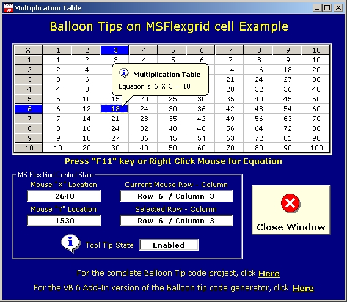



## Balloon Tip example for MSFlexGrid cells \- UPDATED

### Description

UPDATED 3-FEB-2005, added Highlighted cell under mouse cursor. This is an example of how to use Balloon Tool Tips with MSFlexGrid control to get "Context sensitive help" on each cell of the grid. This is only an EXAMPLE of what can be done and is not a complete application. Other controls have similar methods and properties, so you could make this work with list boxes and combo controls for example. In this example I used a simple multiplication table and show the equation as the Balloon Tip. Some of the code could be compacted a bit, but I did this as a request from a not so strong on English fellow, so I made the flow as "clean" reading as I could. Take it, change it, use it!
 
### More Info
 

             |
---                |---
**Submitted On**   |2005-02-06 21:23:42
**By**             |[Mark Mokoski](https://github.com/Planet-Source-Code/PSCIndex/blob/master/ByAuthor/mark-mokoski.md)
**Level**          |Intermediate
**User Rating**    |4.4 (40 globes from 9 users)
**Compatibility**  |VB 6\.0
**Category**       |[VB function enhancement](https://github.com/Planet-Source-Code/PSCIndex/blob/master/ByCategory/vb-function-enhancement__1-25.md)
**World**          |[Visual Basic](https://github.com/Planet-Source-Code/PSCIndex/blob/master/ByWorld/visual-basic.md)
**Archive File**   |[Balloon\_Ti184935262005\.zip](https://github.com/Planet-Source-Code/mark-mokoski-balloon-tip-example-for-msflexgrid-cells-updated__1-58261/archive/master.zip)

